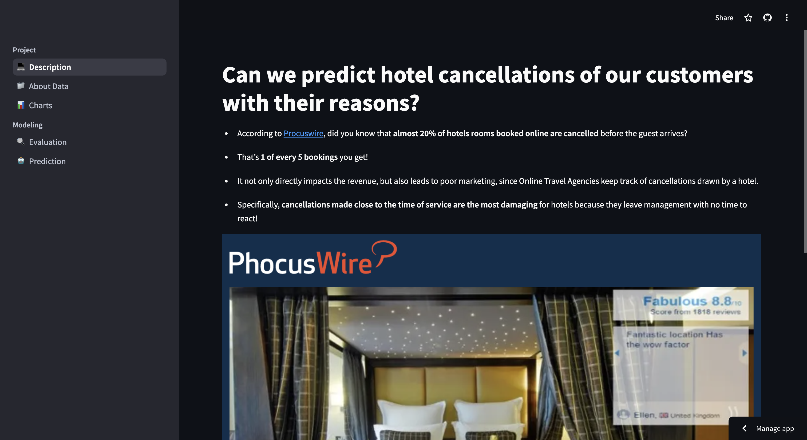

# 🚀 Streamlit Demo App



## 📌 Project Properties

This study aims to **identify individuals who are likely to cancel** in the short term with AI techniques using the dataset shared with us by the hotel.

You can examine the project in detail using the app, this app allows you to:

- Examine the **aim of the project** in the **[Description Section](https://hotel-cancelations.streamlit.app/)**
- Analyze the **dataset interactively** with a Data Dictionary in the **[About Data Section](https://hotel-cancelations.streamlit.app/dataset)**
- Analyze the **charts** for a better understanding of data and the relationships in the **[Charts Section](https://hotel-cancelations.streamlit.app/charts)**
- Examine the **model performance metrics** and **Global Explanation** of the model using SHAP in the **[Evaluation Section](https://hotel-cancelations.streamlit.app/evaluation)**
- Make an **Online** and **Batch** prediction with **Local Explanation** using SHAP in the **[Prediction Section](https://hotel-cancelations.streamlit.app/predict)**

## 📂 Repository Structure

```plaintext
streamlit_demo/
├── images/                        # Images used by the app and repository
│   ├── app.png                    
│   ├── hotel-cancelations.png     
│   └── hotel-service.png          
│   ├── shap_bar_plot.png          # SHAP Global Explainability Bar Plot
│   └── shap_summary_plot.png      # SHAP Global Explainability Summary Plot
├── pages/                         # Python files used by the app
│   ├── charts.py                  # Charts section
│   └── dataset.py                 # About Data section
│   ├── evaluation.py              # Evaluation section
│   └── predict.py                 # Prediction section
│   ├── project.py                 # Description section
├── README.md                      # Repository description
├── explainer.pkl                  # SHAP Tree Explainer object
├── hotel_bookings_prepared.csv    # Preprocessed dataset
├── hotel_cancellation_model.pkl   # ML Model
├── requirements.txt               # Project pip dependencies
├── test_features.pkl              # The features used on model testing
├── welcome.py                     # Home Page for navigating between pages
```

## 🧑‍💻 Contribute

Please feel free to contribute the ML Model or Streamlit Page.
